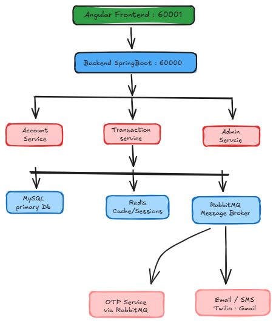
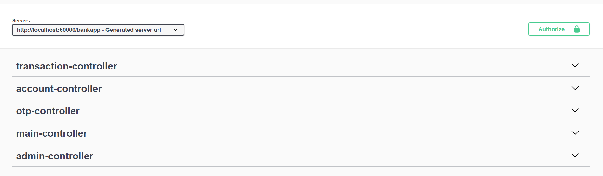
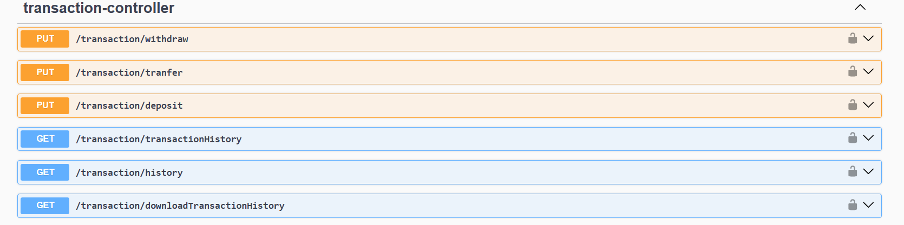
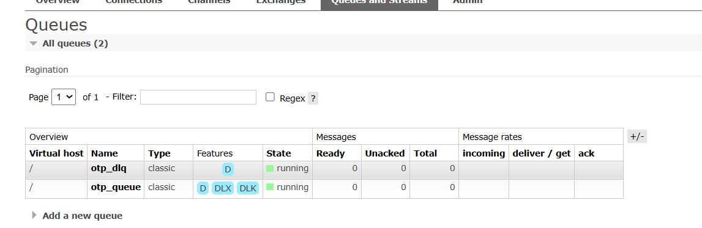
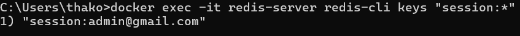

# 🏦 Banking Management System

A production-style banking backend built with Java 21 & Spring Boot 3 — 
featuring microservices-ready architecture, event-driven notifications, 
Redis session management, and role-based access control.

---

## 🏗️ Architecture



---

## ✅ Key Features

**Authentication & Security**
- Multi-identifier login (email / phone / account number)
- JWT authentication with Redis session store
- BCrypt password + transaction PIN hashing
- Role-based access: USER / EMPLOYEE / ADMIN

**Transaction Engine**
- Fund transfers with atomic balance updates (`@Transactional`)
- Deposit / withdrawal with full audit trail
- Transaction history with pagination, sorting & date filtering
- Excel export of transaction history (Apache POI)

**Event-Driven Notifications**
- RabbitMQ with Topic Exchange for OTP & transaction alerts
- Dead Letter Queue (DLQ) for failed message retry
- Async email (JavaMail) + SMS (Twilio) notifications

**Admin Dashboard**
- Employee & user management with paginated, filterable tables
- Dynamic JPA Specifications for multi-criteria filtering
- Audit logging with old/new value JSON diffs
- Bulk employee creation

**Infrastructure**
- Redis for session management and response caching
- Docker Compose for Redis & RabbitMQ
- Swagger / OpenAPI with JWT bearer auth configured
- Custom GlobalExceptionHandler with structured error responses

---

## 🛠️ Tech Stack

| Layer | Technology |
|-------|-----------|
| Language | Java 21 |
| Framework | Spring Boot 3.4 |
| Security | Spring Security + JWT + Redis |
| Database | MySQL 8 + Spring Data JPA |
| Messaging | RabbitMQ (Topic Exchange + DLQ) |
| Caching | Redis |
| Notifications | JavaMail + Twilio SMS |
| Export | Apache POI (Excel) |
| API Docs | Swagger / SpringDoc OpenAPI |
| DevOps | Docker Compose |

---

---

## 📸 Screenshots

### API Documentation (Swagger UI)


### Transaction Transfer Endpoint


### RabbitMQ Queues (OTP Queue + Dead Letter Queue)


### Redis Session Management


## 🚀 Running Locally

### Prerequisites
- Java 21+, Maven, MySQL 8+
- Docker (for Redis & RabbitMQ)

### Steps
```bash
# 1. Start infrastructure
docker-compose up -d

# 2. Configure secrets
cp src/main/resources/application-secret.properties.example \
   src/main/resources/application-secret.properties
# Fill in: DB password, JWT secret, Gmail, Twilio credentials

# 3. Run the app
mvn spring-boot:run
```

Swagger UI: `http://localhost:60000/bankapp/swagger-ui.html`

---

## 📐 Default Admin Credentials
Email: `admin@gmail.com`
Password: `Admin@1234`
